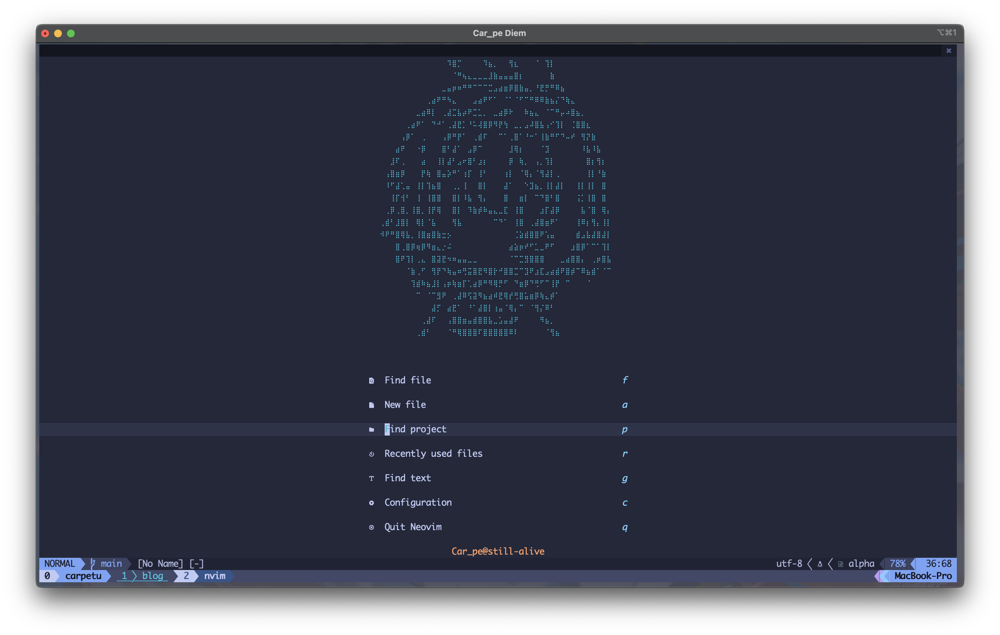
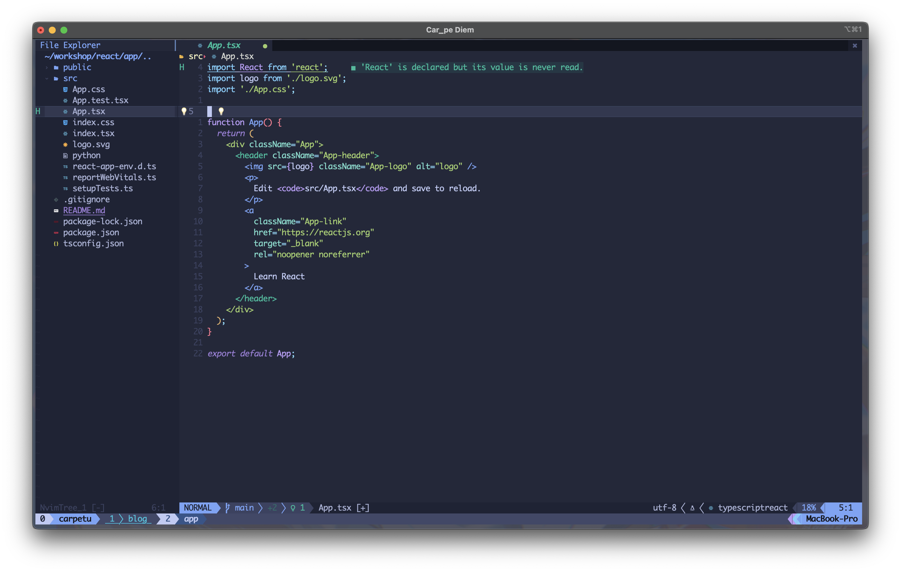
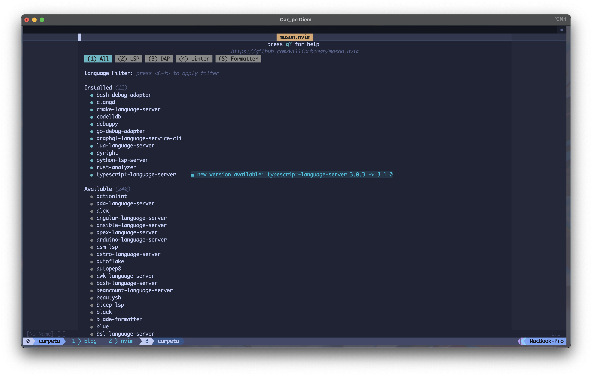
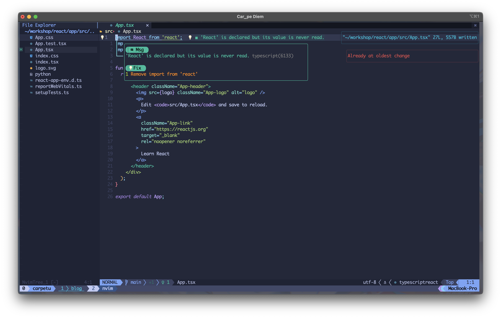
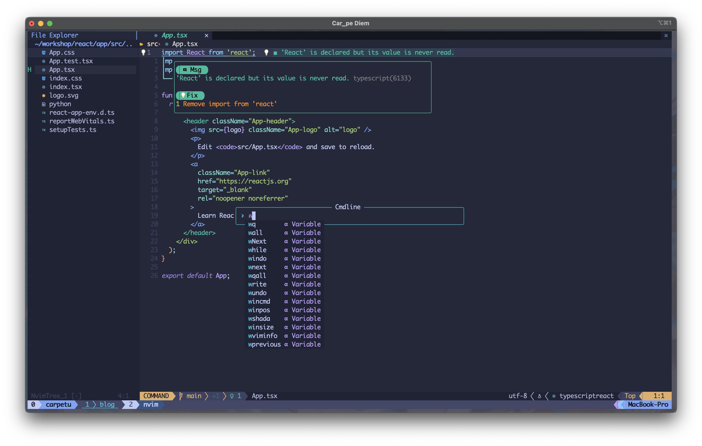
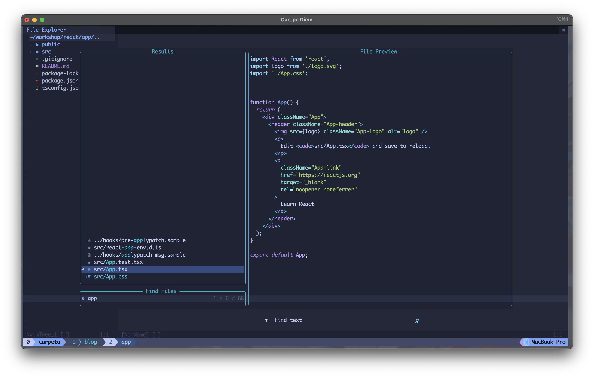
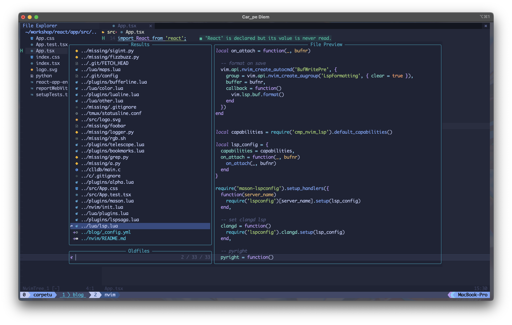
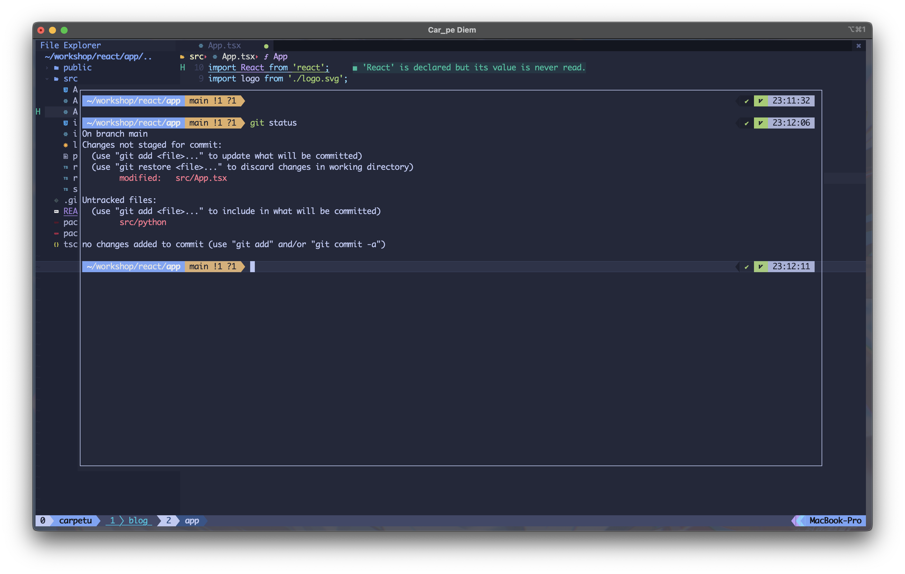

# file tree

```tree
.
├── README.md
├── init.lua
├── lua
│   ├── base.lua
│   ├── color.lua
│   ├── lsp.lua
│   ├── maps.lua │   ├── other.lua
│   ├── plugins
│   │   ├── alpha.lua
│   │   ├── bookmarks.lua
│   │   ├── bufferline.lua
│   │   ├── cmp.lua
│   │   ├── kind.lua
│   │   ├── lspsaga.lua
│   │   ├── lualine.lua
│   │   ├── mason.lua
│   │   ├── nvimtree.lua
│   │   ├── snip.lua
│   │   ├── sniprun.lua
│   │   ├── telescope.lua
│   │   ├── todo-comments.lua
│   │   ├── toggleterm.lua
│   │   └── treesitter.lua
│   └── plugins.lua
├── pic
│   ├── Screenshot_alpha.png
│   ├── Screenshot_cmd.png
│   ├── Screenshot_findfile.png
│   ├── Screenshot_lsp.png
│   ├── Screenshot_mason.png
│   ├── Screenshot_noise.png
│   ├── Screenshot_telescope.png
│   └── Screenshot_toggleterm.png
└── tree

4 directories, 32 files
```

# Screenshot

## alpha_dashboard



* use(['goolord/alpha-nvim'](https://github.com/goolord/alpha-nvim))

## color scheme

**tokyonight**

use(['folke/tokyonight.nvim'](https://github.com/folke/tokyonight.nvim))

## lsp



* use(['neovim/nvim-lspconfig'](https://github.com/neovim/nvim-lspconfig))
* use({
    ['glepnir/lspsaga.nvim'](https://github.com/glepnir/lspsaga.nvim),
    branch = "main",
  })

* use(['williamboman/mason.nvim'](https://github.com/williamboman/mason.nvim))
* use(['williamboman/mason-lspconfig.nvim'](williamboman/mason-lspconfig.nvim))



## noise

use( ['folke/noice.nvim'](https://github.com/folke/noice.nvim))




## telescope

use(['nvim-telescope/telescope.nvim'](https://github.com/nvim-telescope/telescope.nvim))

### find file



### find recent file



## toggleterm(inal)

use(['akinsho/toggleterm.nvim'](https://github.com/akinsho/toggleterm.nvim))



